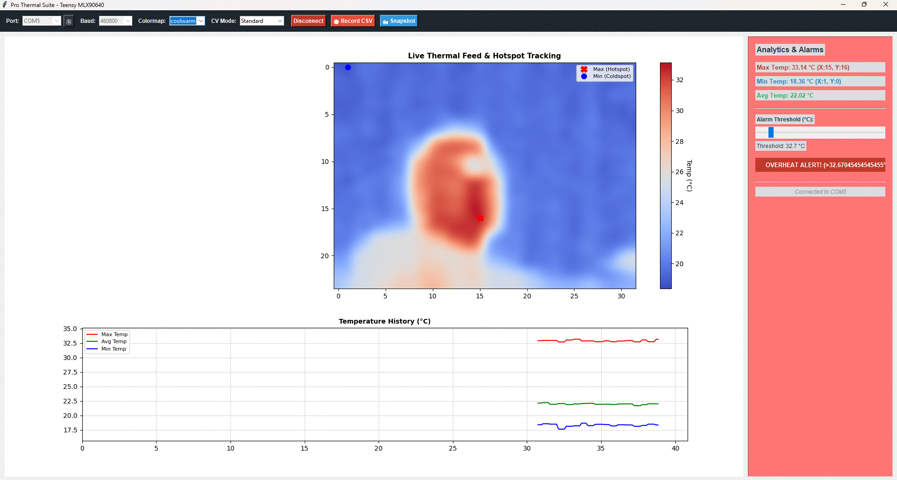

# MLX90640 Thermal Suite

A professional, high-performance Python & Tkinter GUI suite built for real-time thermal data acquisition and visualisation using the **MLX90640 32x24 IR array** driven by a **Teensy** microcontroller. 


## Executive Summary

The **MLX90640 Thermal Suite** is a high-performance desktop telemetry and visualisation application engineered to bridge hardware-level infrared sensing with advanced software analytics. Designed specifically for low-latency serial communication with a Teensy microcontroller running an **MLX90640 32x24 IR sensor array**, this suite transforms raw temperature matrices into smooth, interpolated thermal heatmaps coupled with real-time statistical tracking. 

Built with reliability and performance in mind, it features multi-threaded serial reading to prevent UI stutter, live computer vision modes (edge detection and contour mapping), automated safety threshold alarms, and comprehensive data logging capabilities. Whether used for benchtop electronic diagnostics or environmental monitoring, it provides an intuitive, robust interface for thermal analysis.

---

## Primary Use Cases

* **Electronic Component Diagnostics:** Identify localized overheating, short circuits, or thermal runaway on PCBs and microcontrollers by monitoring precise hotspot coordinates.
* **Thermal Testing & Prototyping:** Log continuous time-series frame telemetry to CSV files for post-run analysis, thermal dissipation testing, and stress evaluations.
* **Safety & Overheat Monitoring:** Set custom alarm thresholds with real-time visual flash triggers to automate safety monitoring during high-temperature operations.
* **Embedded Systems Development:** Serve as a reliable, ready-to-deploy GUI host for custom Teensy-driven sensor nodes streaming high-frequency telemetry over serial.

## Features

* **Live Bicubic Interpolation & Heatmaps:** Smooth, high-resolution visual feedback with customisable colormaps (`inferno`, `plasma`, `magma`, `turbo`, `jet`, `coolwarm`).
* **Hotspot & Coldspot Tracking:** Automatic identification and coordinate crosshair labelling for absolute maximum (hotspot) and minimum (coldspot) pixels on the grid.
* **Real-Time Strip Chart:** A rolling 60-second historical graph tracking Max, Min, and Average temperatures.
* **Overheating Alarm System:** Interactive threshold slider with visual flash alerts when any pixel exceeds safety limits.
* **Advanced Computer Vision Modes:** Switch between Standard thermal mapping, Edge Detection (Canny), and Contour smoothing.
* **Data Logging & Snapshots:** Record continuous timestamped frame telemetry to CSV or export high-res PNG thermal snapshots instantly.

---

## Screenshots

### Main Dashboard (Normal Status)


### Overheat Alarm Triggered


### Exported Snapshot Example


---

## Hardware Requirements

* **MLX90640 32x24 IR Array Sensor** (connected via I2C)
* **Teensy Microcontroller** (e.g., Teensy 4.0 / 4.1 or Teensy 3.5) streaming frame data over Serial in the format: `FRAME:val,val,val,...` (768 comma-separated values per frame).

---

### Pin Connections (Teensy 3.5 to MLX90640)

| MLX90640 Pin | Function | Teensy 3.5 Pin | Notes |
| :--- | :--- | :--- | :--- |
| **VIN / VCC** | Power Supply | **3.3V** | Must be connected to 3.3V (do **not** connect to 5V). |
| **GND** | Ground | **GND** | Standard ground pin. |
| **SDA** | I2C Data | **Pin 18 (SDA0)** | Primary I2C data line for `Wire`. |
| **SCL** | I2C Clock | **Pin 19 (SCL0)** | Primary I2C clock line for `Wire`. |

---
---

## Software Prerequisites

Ensure you have Python 3.8+ installed along with the required libraries:

```bash
pip install numpy matplotlib opencv-python pyserial
