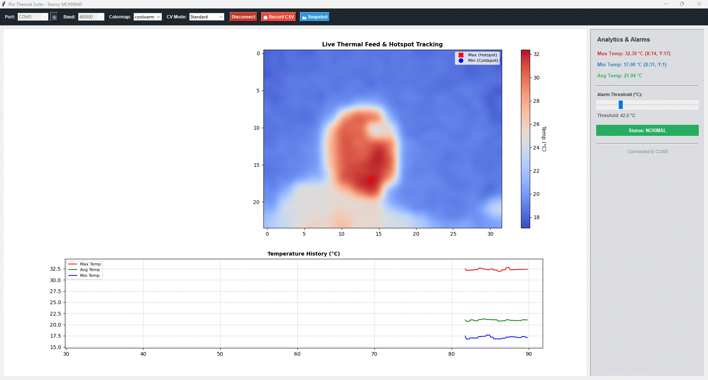
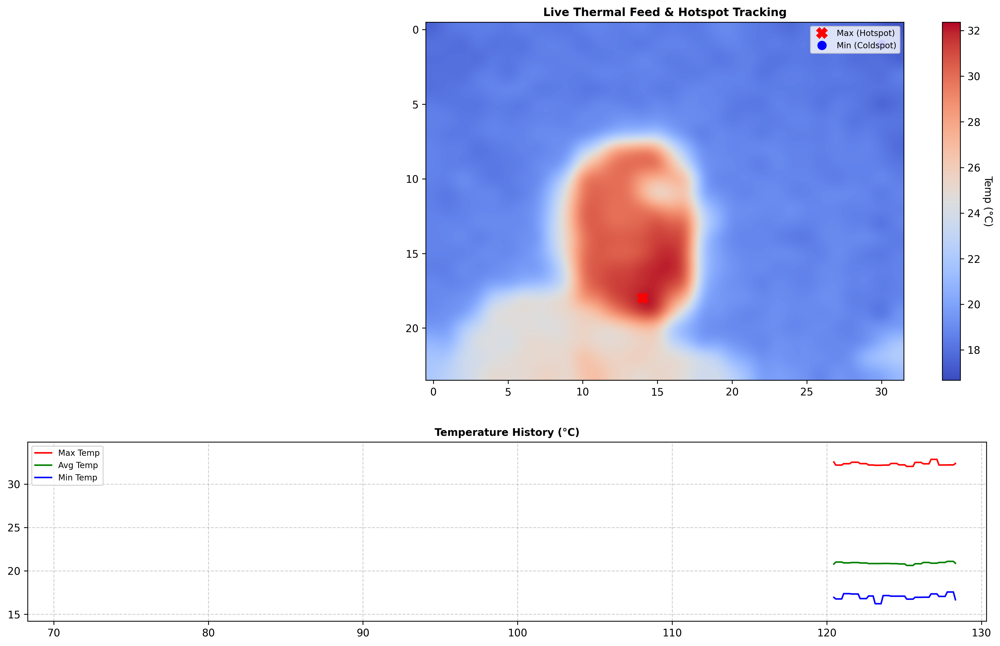

# MLX90640 Thermal Suite

A professional, high-performance Python & Tkinter GUI suite built for real-time thermal data acquisition and visualisation using the **MLX90640 32x24 IR array** driven by a **Teensy** microcontroller. 

## Features

* **Live Bicubic Interpolation & Heatmaps:** Smooth, high-resolution visual feedback with customisable colormaps (`inferno`, `plasma`, `magma`, `turbo`, `jet`, `coolwarm`).
* **Hotspot & Coldspot Tracking:** Automatic identification and coordinate crosshair labelling for absolute maximum (hotspot) and minimum (coldspot) pixels on the grid[cite: 3, 4].
* **Real-Time Strip Chart:** A rolling 60-second historical graph tracking Max, Min, and Average temperatures[cite: 3, 4].
* **Overheating Alarm System:** Interactive threshold slider with visual flash alerts when any pixel exceeds safety limits[cite: 3].
* **Advanced Computer Vision Modes:** Switch between Standard thermal mapping, Edge Detection (Canny), and Contour smoothing[cite: 3, 4].
* **Data Logging & Snapshots:** Record continuous timestamped frame telemetry to CSV or export high-res PNG thermal snapshots instantly[cite: 2, 3, 4].

---

## Screenshots

### Main Dashboard (Normal Status)


### Overheat Alarm Triggered


### Exported Snapshot Example


---

## Hardware Requirements

* **MLX90640 32x24 IR Array Sensor** (connected via I2C)
* **Teensy Microcontroller** (e.g., Teensy 4.0 / 4.1 or Teensy 3.5) streaming frame data over Serial in the format: `FRAME:val,val,val,...` (768 comma-separated values per frame).

---

## Software Prerequisites

Ensure you have Python 3.8+ installed along with the required libraries:

```bash
pip install numpy matplotlib opencv-python pyserial
